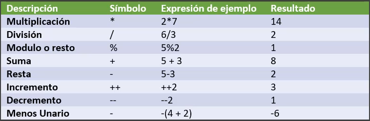
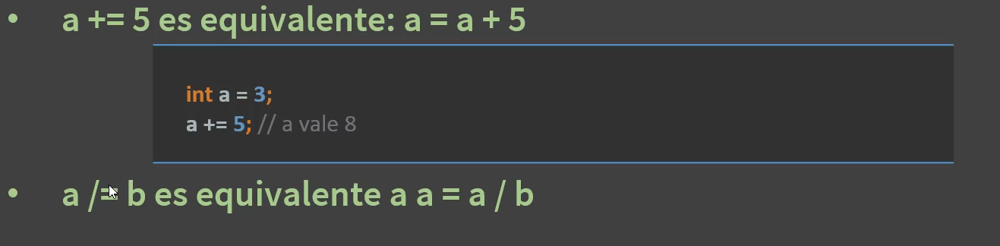
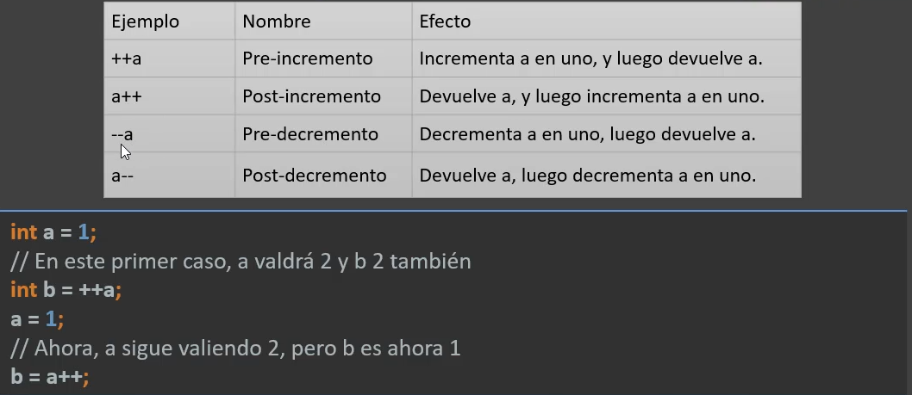
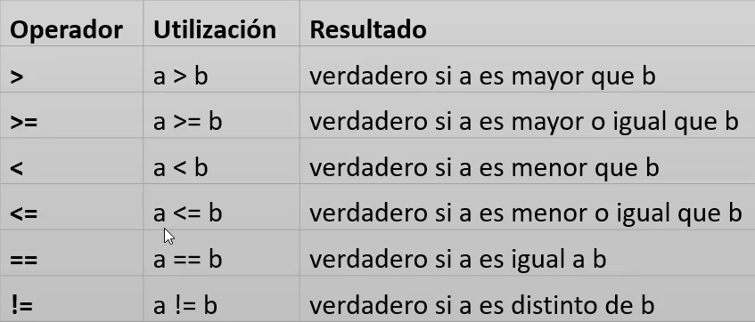
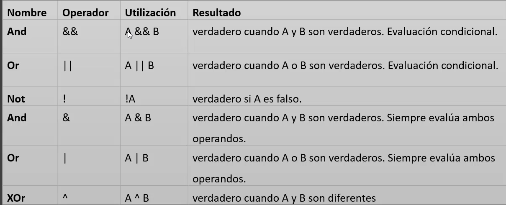

# JAVA

## Strings

Los strings son secuencias de caracteres. En Java, los strings se representan mediante la clase `String`. Un string es
inmutable, lo que significa que una vez creado, no se puede modificar. Sin embargo, se pueden realizar diversas
operaciones con strings utilizando los métodos proporcionados por la clase `String`.

Además, son variables de referencia, lo que significa que almacenan la dirección de memoria donde se encuentra el valor
del string. Cuando se asigna un string a una variable, en realidad se está asignando la referencia al objeto string en
memoria. Por tanto, si se asigna un string a otra variable, ambas variables apuntarán al mismo objeto en memoria. Por
ejemplo:

```java
String str1 = "Hola";
String str2 = str1; // str2 apunta al mismo objeto que str1 
```

Y para comparar el contenido de dos strings, se debe utilizar el método `equals()` en lugar del operador `==`, ya que
este último compara las referencias de los objetos, no su contenido. Por ejemplo:

```java
String str1 = "Hola";
String str2 = "Hola";

// Comparar usando el operador '=='
boolean sonIgualesReferencia = (str1 == str2); // sonIgualesReferencia será true, ya que ambos apuntan al mismo objeto en memoria

boolean sonIguales = str1.equals(str2); // sonIguales será true
```

### Concatenación de Strings

La concatenación de strings se puede realizar utilizando el operador `+` o el método `concat()`. Por ejemplo:

```java
String str1 = "Hola";
String str2 = "Mundo";

// Usando el operador '+'
String resultado1 = str1 + " " + str2; // resultado1 será "Hola Mundo"
// Usando el método 'concat()'
String resultado2 = str1.concat(" ").concat(str2); // resultado2 también será "Hola Mundo"
```

#### Prescedencia en la concatenación

Al concatenar strings con otros tipos de datos, es importante tener en cuenta la precedencia de los operadores. Si
concatenamos un string con un número, el número se convertirá automáticamente a string. Por ejemplo:

```java
String str = "El número es: ";
int numero = 42;
String resultado = str + numero; // resultado será "El número es: 42"
```

Pero si se utiliza el operador `+` con números antes de concatenar con un string, se realizará la suma de los números
antes de la concatenación. Por ejemplo:

```java
String str = "El resultado es: ";
int num1 = 10;
int num2 = 20;
String resultado = str + num1 + num2; // resultado será "El resultado es: 1020" porque num1 y num2 se concatenan como strings después de la concatenación
```

En este caso, `num1` y `num2` se concatenan como strings después de la concatenación con `str`, lo que resulta en "El
resultado es: 1020". Para obtener el resultado correcto de la suma, se debe usar paréntesis para asegurar la precedencia
correcta:

```java
String str = "El resultado es: ";
int num1 = 10;
int num2 = 20;
String resultado = str + (num1 + num2); // resultado será "El resultado es: 30" porque num1 y num2 se suman antes de la concatenación
```

En este caso, `num1` y `num2` se suman antes de la concatenación con `str`, lo que resulta en "El resultado es: 30".

### Inmutabilidad

La inmutabilidad de los String en Java significa que una vez que se crea un objeto String, su contenido no puede
cambiar.

```java
String texto = "Hola";
String texto = texto + " mundo";
```

No estás modificando el mismo objeto. En realidad:

1. Se crea un String con valor "Hola"
2. Luego se crea otro nuevo String con valor "Hola mundo"
3. La variable texto ahora apunta al nuevo objeto

¿Por qué los String son inmutables?

Java lo diseñó así por varias razones importantes:

1. Seguridad

   Los String se usan en cosas sensibles como:

    - conexiones a base de datos
    - rutas de archivos
    - URLs

   Si fueran mutables, podrían ser alterados fácilmente.

2. Performance (String Pool)

   Java usa un String Pool (pool de cadenas):
   ```java
   String x = "Hola";
   String y = "Hola";
   ```
   Ambos apuntan al mismo objeto en memoria

   Esto ahorra memoria, y solo es posible porque los String no cambian.

## Operadores

Java proporciona muchos tipos de operadores que se pueden usar según la
necesidad. Se clasifican según la funcionalidad que brindan

Sirven para realizar cálculos matemáticos, comparar valores, para unir
identificadores y literales, para formar expresiones lógica, toma de decisión etc.

- Operadores Aritméticos: +, -, *, /, %
- Operadores de Asignación: =, +=, -=, *=, /=, %=
- Operadores de Comparación: ==, !=, >, <, >=, <=
- Operadores Lógicos: &&, ||, !
- Operadores de Incremento y Decremento: ++, --
- Operadores de Concatenación: +
- Operadores Unarios: +, -, !
- Operadores Ternarios: ? :
- Operadores de Instancia: instanceof
- Operadores de bits

### Operadores Aritméticos

Se utilizan para realizar operaciones aritméticas simples en tipos de datos
primitivos:



### Operadores Combinados

Se utilizan para realizar una operación aritmética y asignar el resultado a la misma variable:



### Operadores de Incremento y Decremento

Se utilizan para incrementar o decrementar el valor de una variable en 1:



### Operador ternario o condicional

Se utiliza para evaluar una expresión booleana y devolver un valor dependiendo del resultado:

```java
int a = 10;
int b = 20;
String resultado = (a > b) ? "a es mayor que b" : "a es menor o igual que b";
```

En este ejemplo, el operador ternario evalúa la expresión `a > b`. Si es verdadera, devuelve "a" es mayor que b". Si es
falsa, devuelve "a" es menor o igual que b". En este caso, el resultado sería "a" es menor o igual que b".

### Operadores Relacionales

Se utilizan para comparar dos valores y devolver un resultado booleano:



### Operadores Lógicos

Los operadores lógicos permiten evaluar expresiones lógicas y trabajan con operandos booleanos
Realizan las operaciones lógicas de conjunción (AND), disyunción (OR) y negación (NOT)



### Operadores Unarios

Se utilizan para realizar operaciones sobre un solo operando:

```java
int a = 5;
int b = -a; // b será -5, operador unario de negación
boolean c = true;
boolean d = !c; // d será false, operador unario de negación lógica
```

## Precedencia en los operadores lógicos

La precedencia de los operadores lógicos en Java es la siguiente:

1. `!` (NOT)
2. `&&` (AND)
3. `||` (OR)
   Esto significa que el operador NOT tiene la mayor precedencia, seguido por el operador AND, y finalmente el operador
   OR. La precedencia se ejecuta de izquierda a derecha, pero los operadores con mayor precedencia se evalúan primero.
   Por ejemplo:

```java
boolean a = true;
boolean b = false;
boolean c = true;
boolean resultado = a || b && c; // resultado será true, porque el operador AND se evalúa antes que el OR
```

En este caso, el operador AND (`&&`) se evalúa primero, lo que da como resultado `false`, y luego el operador OR (`||`)
se evalúa con `true || false`, lo que da como resultado final `true`. Si se desea cambiar el orden de evaluación, se
pueden usar paréntesis para forzar la precedencia:

```java
boolean a = true;
boolean b = false;
boolean c = true;
boolean resultado = (a || b) && c; // resultado será true, porque el operador OR se evalúa antes que el AND debido a los paréntesis
```

## Arreglos de String

En Java puedes definir un arreglo (array) de String de varias formas, dependiendo de si ya tienes los valores o no.

1. Declarar y asignar valores directamente

```java
   String[] nombres = {"Juan", "María", "Pedro"};
```

2. Declarar el arreglo y luego asignar valores

```java
   String[] nombres = new String[3];

nombres[0]="Juan";
nombres[1]="María";
nombres[2]="Pedro";
```

## Operador ternario

El operador ternario en Java es una forma corta de escribir un if-else. Su sintaxis es:

```java
condicion ?"valor_si_true":"valor_si_false";
```

Ejemplo básico:

```java
int edad = 18;
String resultado = (edad >= 18) ? "Mayor de edad" : "Menor de edad";
```

Aquí:

- Si edad >= 18 es true → devuelve "Mayor de edad"
- Si es false → devuelve "Menor de edad"
  Ejemplo con números

```java
int a = 10;
int b = 20;

int mayor = (a > b) ? a : b;
System.out.

println(mayor); // 20
```

Ejemplo dentro de un print

```java
System.out.println((a %2==0) ?"Par":"Impar");
```

#### Nota importante

El ternario siempre devuelve un valor, por eso se usa para asignaciones o expresiones, no para lógica compleja. Por
ejemplo, no podemos ejecutar una función en alguna de las condiciones, o ejecutar un break, solo podemos devolver un
valor e imprimirlo o asignarlo a una variable.

## Operador Instanceof con tipos abstractos

En Java, todas las clases heredan de Object (directa o indirectamente). Eso significa que cualquier variable declarada
como Object puede apuntar a cualquier tipo de objeto.

```java
Object dato = "Hola mundo";
```

Aquí dato es tipo Object, pero en realidad contiene un String.

### Usando instanceof con Object

Cuando tienes un Object, instanceof sirve para descubrir su tipo real en tiempo de ejecución:

```java
if(dato instanceof String){
        System.out.

println("Es un String");
}
```

🔄 Ejemplo con múltiples tipos

```java
Object dato = 123;

if(dato instanceof String){
        System.out.

println("Texto");
}else if(dato instanceof Integer){
        System.out.

println("Entero");
}else{
        System.out.

println("Otro tipo");
}
```

Esto es común cuando:

- Procesas datos genéricos
- Trabajas con colecciones sin tipar (o legacy)
- Recibes valores dinámicos (APIs, JSON, etc.)

### Problema clásico: perder el tipo

Cuando usas Object, pierdes acceso directo a métodos específicos:

```java
Object dato = "Hola";
// dato.length(); ❌ ERROR
```

Debes validar y hacer casting:

```java
if(dato instanceof String){
String texto = (String) dato;
    System.out.

println(texto.length());
        }
```

### ✅ Forma moderna (Java 16+)

```java
if(dato instanceof
String texto){
        System.out.

println(texto.length());
        }
```

### 🧠 Uso de Number junto con Integer.valueOf() en Java

En Java, la clase Number es una clase abstracta que funciona como la superclase de todos los tipos numéricos
envolventes (wrapper classes), como:

- Integer
- Double
- Float
- Long
- Short
- Byte

Esto permite tratar diferentes tipos de números de forma genérica y polimórfica.

#### 🔢 Creación de objetos numéricos

La expresión:

```java
Integer.valueOf(7)
```

convierte el valor primitivo int (7) en un objeto de tipo Integer.

Esto forma parte del proceso llamado autoboxing, aunque también puede hacerse automáticamente:

```java
Integer num = 7; // autoboxing
```

#### 🔗 Asignación a Number

```java
Number num = Integer.valueOf(7);
```

Aquí ocurren dos cosas importantes:

- Se crea un objeto Integer
- Se almacena en una variable de tipo Number

Esto es posible porque Integer hereda de Number, aplicando el principio de polimorfismo.

### 🎯 ¿Para qué sirve usar Number?

Usar Number permite trabajar con distintos tipos numéricos sin depender de uno específico:

```java
Number num;

num =Integer.

valueOf(10);

num =Double.

valueOf(3.14);

num =Float.

valueOf(2.5f);
```

👉 Esto es útil cuando:

- No sabes qué tipo numérico vas a manejar
- Trabajas con datos dinámicos (APIs, JSON, bases de datos)
- Diseñas código más flexible y reutilizable

#### ⚠️ Limitaciones de usar Number

Al usar Number, solo puedes acceder a métodos comunes definidos en esta clase:

```java
num.intValue();
num.

doubleValue();
num.

floatValue();
```

Pero no puedes acceder a métodos específicos de cada tipo:

```java
Integer x = (Integer) num;
x.

compareTo(5); // ✅ válido

// num.compareTo(5); ❌ error de compilación
```

👉 Esto sucede porque la variable está tipada como Number, no como Integer.

## ⚙️ Precedencia de operadores en Java

La precedencia de operadores en Java define el orden en que se evalúan las operaciones dentro de una expresión cuando
hay varios operadores.

Los operadores con mayor precedencia se evalúan primero, y los de menor precedencia después. Si dos operadores tienen la
misma precedencia, se aplica la asociatividad (generalmente de izquierda a derecha).

🧩 Ejemplo

```java
int resultado = 5 + 3 * 2;
```

Primero se evalúa la multiplicación (3 * 2 = 6) y luego la suma:

```java
resultado =5+6=11;
```

### 🔝 Orden básico de precedencia (simplificado)

- Paréntesis ()
- Operadores unarios (++, --, !)
- Multiplicación, división, módulo (*, /, %)
- Suma y resta (+, -)
- Operadores relacionales (<, >, <=, >=)
- Igualdad (==, !=)
- AND lógico (&&)
- OR lógico (||)
- Operador ternario (? :)
- Asignación (=, +=, etc.)

### ⚠️ Buena práctica

Usar paréntesis mejora la claridad y evita errores:

```java
int resultado = (5 + 3) * 2; // resultado = 16
```

## 🔀 Flujos de control: if y switch en Java

Los flujos de control permiten ejecutar diferentes bloques de código según una condición.

### ✅ if

Se usa cuando quieres evaluar condiciones booleanas más complejas o con rangos.

Sintaxis:

```java
if(condicion){
// código si es true
        }else if(otraCondicion){
// otra condición
        }else{
// código si ninguna se cumple
        }
```

Ejemplo:

```java
int edad = 20;

if(edad >=18){
        System.out.

println("Mayor de edad");
}else{
        System.out.

println("Menor de edad");
}
```

👉 Ideal para:

- Comparaciones (>, <, ==)
- Condiciones combinadas (&&, ||)
- Lógica más flexible
-

### 🔁 switch

Se usa cuando tienes múltiples casos basados en un mismo valor.

Sintaxis:

```java
switch(variable){
        case valor1:
// código
        break;
        case valor2:
// código
        break;
default:
// código por defecto
        }
```

Ejemplo:

```java
int dia = 2;

switch(dia){
        case 1:
        System.out.

println("Lunes");
break;
        case 2:
        System.out.

println("Martes");
break;
default:
        System.out.

println("Otro día");
}
```

👉 Ideal para:

- Comparar un solo valor contra múltiples opciones
- Código más limpio que muchos if-else

- ### ⚠️ Nota importante
En switch, el break evita que se ejecuten los siguientes casos (fall-through).
Desde Java moderno, existe una versión más limpia:

```java
switch (dia) {
   case 1 -> System.out.println("Lunes");
   case 2 -> System.out.println("Martes");
   default -> System.out.println("Otro día");
}
```

